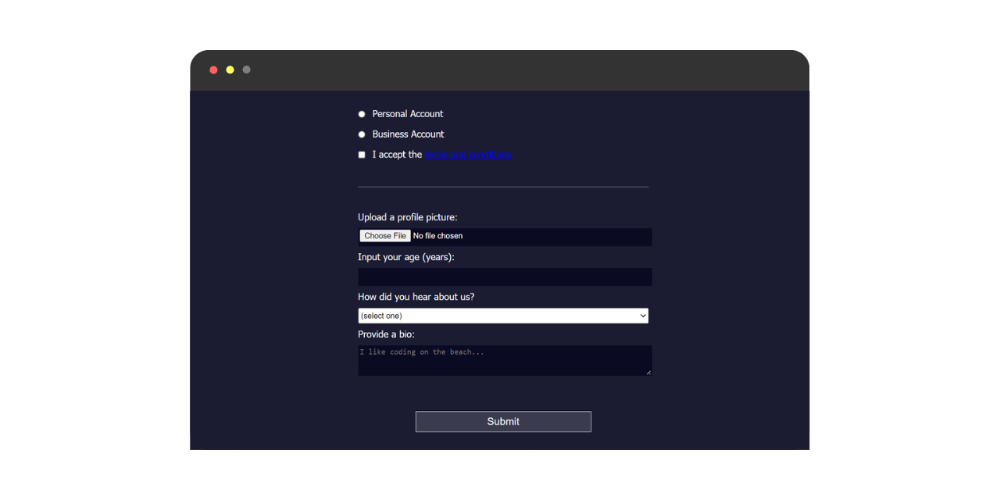

<h2>Registration Form</h2>

Step 1Passed
Welcome to the Registration Form project! Start by adding the !DOCTYPE html declaration at the top of the document so the browser knows what type of document it's reading.
Step 2Passed
Below the DOCTYPE, add an html element with a lang attribute set to en, so that you have a place to start putting some code.
Step 3Passed
Next, add opening and closing head and body tags within the html element.
Step 4Passed
Add a title and a meta elements to the head. Give your project a title of Registration Form, and give a charset attribute with a value of UTF-8 to your meta element.
Step 5Passed
Nest a self-closing link element within the head element. Give it a rel attribute with value of stylesheet and an href attribute with a value of styles.css.
Step 6Passed
Within the body, provide a heading context for the content, by adding an h1 with the text Registration Form.
Step 7Passed
Below the heading, use the following text within a paragraph element to encourage users to register:

Please fill out this form with the required information
Step 8Passed
To spruce the project up, let us add some CSS. Begin by giving the body a width of 100%, and a height of 100vh.
Step 9Passed
Now, get rid of the horizontal scroll-bar, by setting the body default margin added by some browsers to 0.
Step 10Passed
That is better. Now, make the background easy on the eyes, by changing the body background-color to #1b1b32. Then, to see the text, change the color to #f5f6f7.
Step 11Passed
As suggested by the title, you are creating a form. So, after the p element, insert a form with an action attribute targeting https://register-demo.freecodecamp.org.
Step 12Passed
As the form will have three distinct sections, add three fieldset elements within the form element.
Step 13Passed
The first fieldset will hold name, email, and password fields. Start by adding four label elements to the first fieldset.
Step 14Passed
Add the following text to the label elements:

Enter Your First Name:
Enter Your Last Name:
Enter Your Email:
Create a New Password:
Step 15Passed
As label elements are inline by default, they are all displayed side by side on the same line, making their text hard to read. To make them appear on separate lines, add display: block to the label element, and add a margin of 0.5rem 0, to separate them from each other.
Step 16Passed
Nest an input element within each label. Be sure to add each input after the label text, and include a space after the colon.
Step 17Passed
Specifying the type attribute of a form element is important for the browser to know what kind of data it should expect. If the type is not specified, the browser will default to text.

Give the first two input elements a type attribute of text, the third a type attribute of email, and the fourth a type attribute of password.

The email type only allows emails with a @ and a . in the domain. The password type obscures the input, and warns if the site does not use HTTPS.
Step 18Passed
The first input element with a type of submit is automatically set to submit its nearest parent form element.

To handle the form submission, after the last fieldset element add an input element with the type attribute set to submit and the value attribute set to Submit.
tep 19Passed
At this point, you should be able to submit the form. However, you might notice not much happens.

To make the form more interactive, add the required attribute to the input elements in the first fieldset.

Now, if you try to submit the form without filling in the required fields, you will see an error message.
Step 20Passed
Certain type attribute values come with built-in form validation. For example, type="email" requires that the value be a valid email address.

Add custom validation to the password input element, by adding a minlength attribute with a value of 8. Doing so prevents inputs of less than 8 characters being submitted.
Step 21Passed
With type="password" you can use the pattern attribute to define a regular expression that the password must match to be considered valid.

Add a pattern attribute to the password input element to require the input match: [a-z0-5]{8,}

The above is a regular expression which matches eight or more lowercase letters or the digits 0 to 5. Then, remove the minlength attribute, and try it out.
Step 22Passed
Let us go to the next part of the registration form. This section will ask for the type of account the user is opening, and will confirm the user has read the terms and conditions.

Start by adding three label elements to the second fieldset.
Step 23Passed
Users will be allowed to choose either a Personal Account or Business Account.

To do this, within each of the first two label elements, add one input element with type="radio".
Step 24Passed
For the terms and conditions, add an input with a type of checkbox to the third label element. Also, as we do not want users to sign up, without having read the terms and conditions, make it required.
Step 25Passed
Within each corresponding label element, and immediately after the input element, add a space and add the following text:

Personal Account
Business Account
I accept the terms and conditions
Step 26Passed
You only want one radio input to be selectable at a time. However, the form does not know the radio inputs are related.

To relate the radio inputs, give them the same name attribute with a value of account-type. Now, it is not possible to select both radio inputs at the same time.
Step 27Passed
To finish this fieldset off, link the text terms and conditions in the third label to the following location:

https://www.freecodecamp.org/news/terms-of-service/
Step 28Passed
Moving on to the final fieldset. What if you wanted to allow a user to upload a profile picture?

Well, the input type file allows just that. Add a label with the text Upload a profile picture: , and add an input accepting a file upload.
Step 29Passed
Add another label after the first, with the text Input your age (years): . Then, nest an input with the type of number.

As we do not want users under the age of 13 to register, add a min attribute to the input with a value of 13. Also, we can probably assume users over the age of 120 will not register; add a max attribute with a value of 120.

Now, if someone tries to submit the form with values outside of the range, a warning will appear, and the form will not submit. Give it a try.
Step 30Passed
Adding a dropdown to the form is easy with the select element. The select element is a container for a group of option elements, and the option element acts as a label for each dropdown option. Both elements require closing tags.

Start, by adding a select element below the two label elements. Then, nest 5 option elements within the select element.
Step 31Passed
Nest the select element (with its option elements) within a label element with the text How did you hear about us?. The text should come before the select element.
Step 32Passed
The dropdown options are currently empty. To give them content, add the following text to each subsequent option element:

(select one)
freeCodeCamp News
freeCodeCamp YouTube Channel
freeCodeCamp Forum
Other
Step 33Passed
Submitting the form with an option selected would not send a useful value to the server. As such, each option needs to be given a value attribute. Without which, the text content of the option will be submitted to the server.

Give the first option a value of "", and the subsequent option elements value attributes from 1 to 4.
Step 34Passed
The textarea element acts like an input element of type text, but comes with the added benefit of being able to receive multi-line text, and an initial number of text rows and columns.

Users will be able to register with a bio. Add a label with the text Provide a bio: at the end of the fieldset. Add a textarea element inside the label element. Note that the textarea requires a closing tag.
Step 35Passed
The textarea appears too small. To give it an initial size, you can add the rows and cols attributes.

Add an initial size of 3 rows and 30 columns.
Step 36Passed
To give Campers an idea of what to put in their bio, the placeholder attribute is used. The placeholder accepts a text value, which is displayed until the user starts typing.

Give the textarea a placeholder of I like coding on the beach....
Step 37Passed
With form submissions, it is useful, and good practice, to provide each submittable element with a name attribute. This attribute is used to identify the element in the form submission.

Give each submittable element a unique name attribute of your choosing, except for the two radio inputs.
Step 38Passed
The HTML for the registration form is finished. Now, you can spruce it up a bit.

Start by changing the font to Tahoma, and the font size to 16px in the body.
Step 39Passed
Center the h1 and p elements by giving them a margin of 1em auto. Then, align their text in the center as well.
Step 40Passed
Center the form element, by giving it a margin of 0 auto. Then, fix its size to a maximum width of 500px, and a minimum width of 300px. In between that range, allow it to have a width of 60vw.
Step 41Passed
During development, it is useful to see the fieldset default borders. However, they make the content appear too separated.

Remove the border, and add 2rem of padding only to the top and bottom of each fieldset. Be sure to remove the padding from the left and right.
Step 42Passed
To give the fieldset elements a bit of separation, select them and give them a border-bottom of 3px solid #3b3b4f.
Step 43Passed
The border of the last fieldset element looks a little out of place. You can select the last element of a specific type using the last-of-type CSS pseudo-class, like this:

p:last-of-type { }
That will select the last p element. Create a new selector that targets the last fieldset element and set its border-bottom to none.
Step 44Passed
It would be nicer to have the label text appear above the form elements.

Select all input, textarea, and select elements, and make them take up the full width of their parent elements.

Also, add 10px of margin to the top of the selected elements. Set the other margins to 0.
Step 45Passed
For the second fieldset, you want the input and label text to appear on the same line.

Start, by giving the input elements in the second fieldset a class of inline.
Step 46Passed
Select only the .inline elements, and give them width of unset. This will remove the earlier rule which set all the input elements to width: 100%.
Step 47Passed
Add some space between the .inline elements and the label text, by giving a right margin of 0.5em. Also, set all the other margin to 0.
Step 48Passed
If you look close enough, you will notice the .inline elements are too high on the line.

To combat this, set the vertical-align property to middle.
Step 49Passed
To make the input and textarea elements blend in with the background theme, set their background-color to #0a0a23. Then, give them a 1px, solid border with a color of #0a0a23.
Step 50Passed
Currently, if you type in the input or textarea elements, you will not be able to see the text. Also, their height is too small to be easy to use.

Fix this, by setting the color to #ffffff, and setting their min-height to 2em.
You want the select element to remain with a white background, but now it is not getting the same min-height as the input and textarea elements.

Move the min-height property and value so that all three element types have the same min-height value, and the select element still has a white background.
Step 51Passed
You want the select element to remain with a white background, but now it is not getting the same min-height as the input and textarea elements.

Move the min-height property and value so that all three element types have the same min-height value, and the select element still has a white background.
Step 52Passed
To style the submit button, you can use an attribute selector, which selects an element based on the given attribute value. Here is an example:

input[name="password"]
The above selects input elements with a name attribute value of password.

Now, use the attribute selector to style the submit button with a display of block, and a width of 60%.
Step 53Passed
With a display of block the submit button sits flush against the left edge of its parent.

Use the same technique used to center the form to center the submit button.
Step 54Passed
To make the submit button look more in line with the rest of the form, give it the same height as the other fields (2em). Also, increase the font-size to 1.1rem.
Step 55Passed
To make the submit button appear more distinct, give it a background-color of #3b3b4f, and a border-color of white.
Step 56Passed
Lastly, for the submit button, you want to separate it from the fieldset above, and adjust its width to never be below 300px.

Change the margin property to include 1em on the top and bottom, while leaving the right and left margins set to auto. Then set the width as described above.
Step 57Passed
Most browsers inject their own default CSS properties and values for different elements. If you look closely, you might be able to notice the file input is smaller than the other text input elements. By default, a padding of 1px 2px is given to input elements you can type in.

Using another attribute selector, style the input with a type of file to be the same padding as the other input elements.
Step 58Passed
Speaking of padding, the submit button is sitting at the bottom of the form element. Add 2em of padding only to the bottom of the form.
Step 59Passed
Last, but not least, change the text color of the terms and conditions link to #dfdfe2.

Well done! You have completed the final part of the Registration Form practice project.

End.
